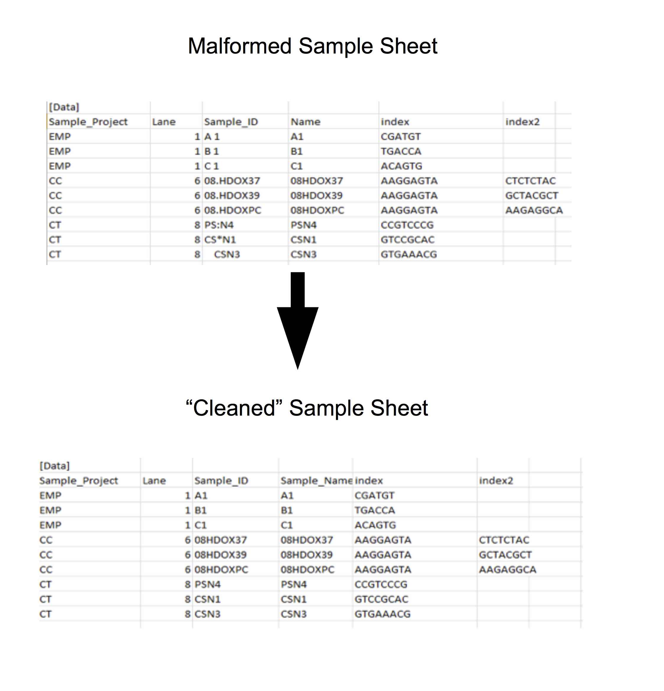
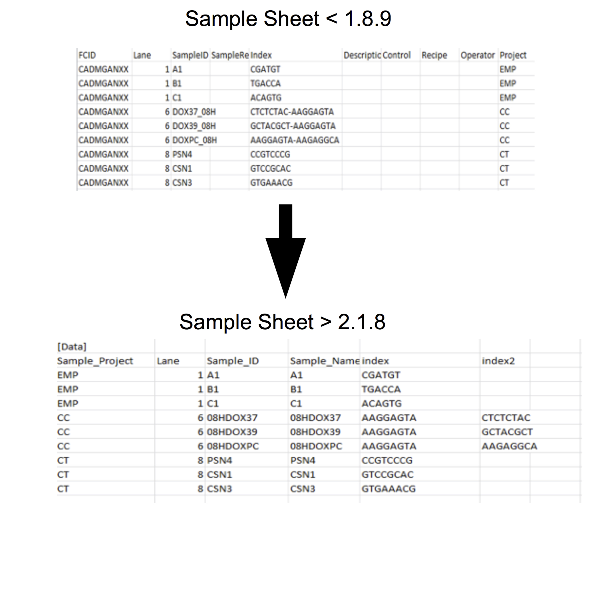

## The basecallQC package

The basecallQC package provides a set of tools to streamline basecalling and demultiplexing using the Illumina bcl2Fastq software.

The basecall package includes functions too:- 

- "Clean" Illumina bcl2Fastq versions > 2.1.8 samplesheets e.g. Remove invalid sample names, whitespaces, correct column headers
- Convert Samplesheets from Illumina bcl2Fastq versions < 1.8.9 to be compatable to Illumina bcl2Fastq versions > 2.1.8.
- Create base masks to used for Illumina basecalling with bcl2Fastq versions > 2.1.8.
- Create summary tables and plots from Illumina basecalling with bcl2Fastq versions > 2.1.8.


## Cleaning and updating the Sample Sheet

The Illumina bcl2Fastq program requires a sample sheet to dictate sample names, indexes and parameters for basecalling and demultiplexing. 

The construction of sample sheets for basecalling and demultiplexing requires specific column names,valid names Sample IDs and correct indexes. The complexity of working with Illumina sample sheets is compounded by the use of different sample sheet specifications before and after version 1.8.9 of the bcl2Fastq program.

The basecallQC package uses the **validateBCLSheet** function to both "clean" sample sheets to have valid column and sample names as well as to update sample sheets for versions < 1.8.9 to be compatable with version > 2.18   

To update a samplesheet, first the parameters for the Run must be captured using the **setBCL2FastQparams** command. The resulting  BCL2FastQparams object contains information on the Run parsed from the RunParameters.xml such as the expected index length. 

Once the BCL2FastQparams object has been created, a data.frame or matrix can be passed to the **validateBCLSheet** alongside the BCL2FastQparams object to create a valid sample sheet object, as illustrated in Figure 1. which may be written to file.

```{r, cleaning, fig.show='hold',warning=FALSE,message=FALSE}
library(basecallQC)
fileLocations <- system.file("extdata",package="basecallQC")
runXML <- dir(fileLocations,pattern="runParameters.xml",full.names=TRUE)
config <- dir(fileLocations,pattern="config.ini",full.names=TRUE)
sampleSheet <- dir(fileLocations,pattern="*\\.csv",full.names=TRUE)
bcl2fastqparams <- setBCL2FastQparams(runXML,config,runDir=getwd(),verbose=FALSE)
cleanedSampleSheet <- validateBCLSheet(sampleSheet,param=bcl2fastqparams)
head(cleanedSampleSheet)
```

<!--  -->
<!--  -->


## Base masking and the bcl2Fastq2 command.

The basecallQC package can also provide the base masks and basecalling command for bcl2Fastq2 versions > 2.1.8 from the cleaned sample sheet and the BCL2FastQparams object.

The **createBaseMasks** function creates a tibble data.frame of basemasks per lane from a cleaned sample sheet, as from validateBCLsheet, and a BCL2FastQparams object.

```{r, basemasks, fig.show='hold',warning=FALSE,message=FALSE}
fileLocations <- system.file("extdata",package="basecallQC")
runXML <- dir(fileLocations,pattern="runParameters.xml",full.names=TRUE)
config <- dir(fileLocations,pattern="config.ini",full.names=TRUE)
sampleSheet <- dir(fileLocations,pattern="*\\.csv",full.names=TRUE)
bcl2fastqparams <- setBCL2FastQparams(runXML,config,runDir=getwd(),verbose=FALSE)
cleanedSampleSheet <- validateBCLSheet(sampleSheet,param=bcl2fastqparams)
baseMasks <- createBasemasks(cleanedSampleSheet,param=bcl2fastqparams)
baseMasks
```

Following the creating of a base masks tibble data.frame, the **createBCLcommand** function takes the cleaned sample sheet, a BCL2FastQparams object and the base masks data.frame to create the command to be used for Illumina basecalling/demultiplexing using  bcl2Fastq2 versions > 2.1.8.

The command is returned as a character string to allow the user to control submission of command to best fir the user's system.

```{r, submitCommand, fig.show='hold',warning=FALSE,message=FALSE}
toSubmit <- createBCLcommand(bcl2fastqparams,cleanedSampleSheet,baseMasks)
toSubmit
```


## Running the basecallQC pipeline

The basecallQC package provides a pipeline function to allow the user to clean/convert the samplesheet, create the bcl2Fastq2 command and parse the results. The resulting basecallQC object can then be used to produce summary tables, plots and a report.

The basecallQC function takes a BCL2FastQparams object for the Run, a cleaned sample sheet and any Run Metadata that the user wishes to attach to their experiment and returns a **basecallQC** object.

The resulting **basecallQC** object can be used with basecallQC's plotting and reporting functions.

```{r, basecallQC, fig.show='hold',warning=FALSE,message=FALSE}
fileLocations <- system.file("extdata",package="basecallQC")
runXML <- dir(fileLocations,pattern="runParameters.xml",full.names=TRUE)
config <- dir(fileLocations,pattern="config.ini",full.names=TRUE)
sampleSheet <- dir(fileLocations,pattern="*\\.csv",full.names=TRUE)
outDir <- file.path(fileLocations,"Runs/161105_D00467_0205_AC9L0AANXX/C9L0AANXX/")
bcl2fastqparams <- setBCL2FastQparams(runXML,config,runDir=getwd(),outDir,verbose=FALSE)
bclQC <- basecallQC(bcl2fastqparams,RunMetaData=NULL,sampleSheet)
class(bclQC)
```

## Plots, tables and reports from the basecallQC pipeline. 

The **basecallQC** object contains information on demultiplexing, basecalling and run parameters.

Summary HTML tables for demultiplexing and basecalling statitistics can be generated using the **summaryDemuxTable** and **summaryConvStatsTable** repsectively. The output argument can be set to "static" or "html" to allow for tables for use in non-interactive and interactive modes.


```{r, tables, fig.show='hold',warning=FALSE,message=FALSE}
summaryConvStatsTable(bclQC,output = "html")
summaryDemuxTable(bclQC,output = "html")
```

The user may also visualise the results using basecallQC's plotting functions for basecalling and demultiplexing stats.

```{r, plots1, fig.show='hold',warning=FALSE,message=FALSE, fig.width=5, fig.height=5}
passFilterBar(bclQC,groupBy="Sample")

```

```{r, plots2, fig.show='hold',warning=FALSE,message=FALSE, fig.width=5, fig.height=5}

passFilterTilePlot(bclQC,metricToPlot = "Yield")

```

```{r, plots3, fig.show='hold',warning=FALSE,message=FALSE, fig.width=5, fig.height=5}

demuxBarplot(bclQC,groupBy="Sample")
```


```{r, plots4, eval=F, warning=FALSE,message=FALSE}
reportBCL(bclQC)
```


